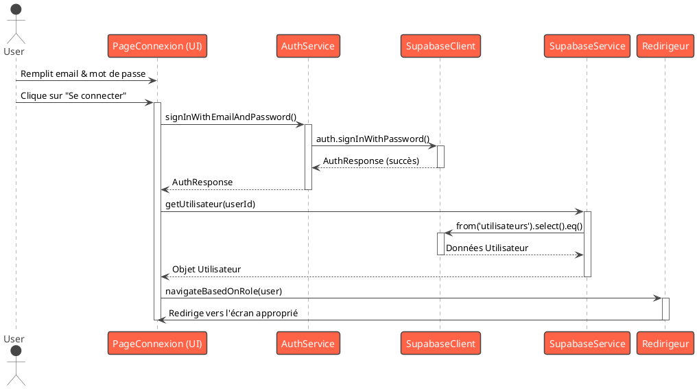
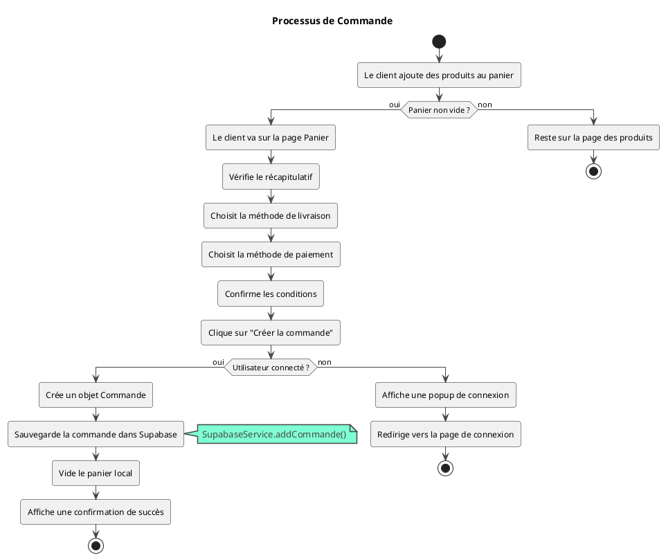

## Diagrammes de Séquence et d'Activité

### Analyse des Concepts POO

- **Encapsulation :** Chaque classe de données (ex: `Produit`, `Commande`) regroupe ses attributs et les méthodes pour les manipuler (`toMap`, `fromMap`). Les services (ex: `SupabaseService`, `AuthService`) encapsulent la logique métier et l'accès à la base de données, masquant la complexité interne.

- **Héritage :** Votre projet utilise principalement l'héritage fourni par le framework Flutter (`StatefulWidget`, `StatelessWidget`). Il n'y a pas de hiérarchie d'héritage complexe dans vos modèles de données, ce qui favorise la composition, une approche moderne et flexible.

- **Polymorphisme :** Le polymorphisme est visible dans la gestion des rôles. Par exemple, la fonction `navigateBasedOnRole` redirige l'utilisateur vers des écrans différents (`Accueila`, `Accueilu`, `AccueilLivreur`) en fonction de la valeur de `Utilisateur.roleutilisateur`. C'est une forme de polymorphisme qui adapte le comportement de l'application au type de l'objet `Utilisateur`.

### Diagramme de Séquence : Connexion d'un Utilisateur

### Diagramme d'Activité : Processus de Commande Client

